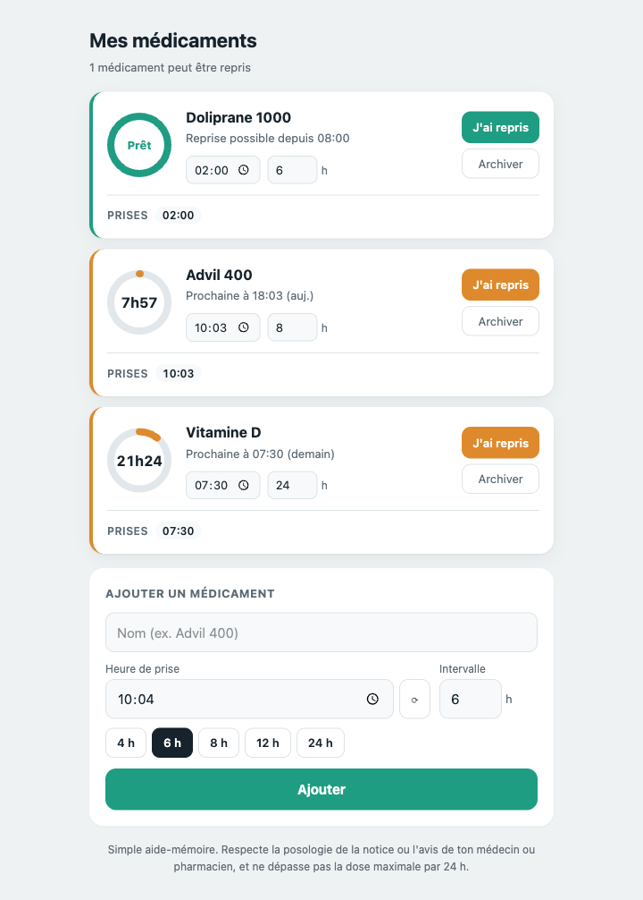

# Rappelo - Rappel de médicament


Un aide-mémoire de prise de médicaments, simple et privé : plus besoin de se souvenir de l'heure de la dernière prise, ni de calculer à la main le prochain créneau autorisé.

Application web légère, 100 % locale : aucune donnée n'est envoyée à un serveur, tout reste dans le `localStorage` du navigateur.

## Aperçu



## Fonctionnalités

- Ajout d'un médicament avec heure de dernière prise et intervalle minimal (en heures)
- Anneau de progression par médicament : temps restant avant la prochaine prise autorisée, ou statut « Prêt »
- Bouton « J'ai repris » pour enregistrer une nouvelle prise en un clic
- Édition manuelle de l'heure de prise et de l'intervalle
- Historique des prises par médicament
- Archivage, réactivation et suppression définitive des médicaments
- Tri automatique : le médicament le plus proche d'être disponible (ou le plus en retard) apparaît en premier
- Aucun compte, aucun serveur : tout est stocké localement dans le navigateur
- Rendu compatible SSR : l'horloge et le stockage local ne s'activent qu'après l'hydratation côté client

## Stack technique

- [Nuxt 4](https://nuxt.com/)
- [Vue 3](https://vuejs.org/) (Composition API, `<script setup>`)
- [Tailwind CSS 4](https://tailwindcss.com/) (via `@tailwindcss/vite`)
- TypeScript
- [pnpm](https://pnpm.io/)

## Démarrage

Prérequis : Node.js et pnpm.

```bash
pnpm install
pnpm dev
```

L'application est disponible sur [http://localhost:3000](http://localhost:3000).

### Autres commandes

| Commande         | Description                          |
| ---------------- | ------------------------------------- |
| `pnpm dev`        | Serveur de développement              |
| `pnpm build`      | Build de production                   |
| `pnpm preview`    | Prévisualisation du build de production |
| `pnpm generate`   | Génération statique                   |

## Structure du projet

```
app/
├── app.vue                   # Point d'entrée, monte <NuxtPage />
├── pages/index.vue           # Page principale
├── components/
│   ├── MedCard.vue           # Carte d'un médicament actif (anneau, édition, actions)
│   ├── ArchivedMedCard.vue   # Carte d'un médicament archivé
│   ├── AddMedForm.vue        # Formulaire d'ajout
│   └── IntakeHistory.vue     # Historique des prises
├── composables/
│   ├── useMeds.ts            # État des médicaments + persistance localStorage
│   └── useNow.ts             # Horloge réactive (tick 1 s)
├── utils/
│   ├── time.ts                # Formatage des heures et dates relatives
│   └── id.ts                  # Génération d'identifiants
└── types/index.ts             # Type Med
```

## Modèle de données

Chaque médicament (`Med`) est stocké sous cette forme :

```ts
interface Med {
  id: string
  name: string
  takenMs: number      // horodatage de la dernière prise
  intervalH: number    // intervalle minimal entre deux prises (heures)
  history: number[]    // horodatages de toutes les prises
  archivedAt: number | null
}
```

L'ensemble est conservé dans le `localStorage` du navigateur, sous la clé `pills-time:meds` : rien ne transite par un serveur.

## Avertissement

Rappelo est un simple aide-mémoire, pas un dispositif médical. Respecte toujours la posologie indiquée sur la notice ou par ton médecin ou pharmacien, et ne dépasse pas la dose maximale recommandée sur 24 h.

## Licence

MIT - See [here](LICENSE)
